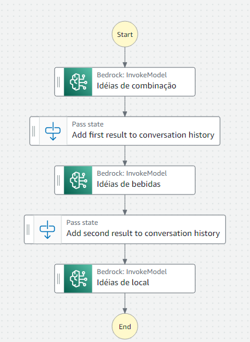

# Introduction to Amazon Step Functions

This project demonstrates the integration between AWS Step Functions and Amazon Bedrock using a romantic suggestions use case.

Two AWS services were used to implement suggestions for a romantic date:

- [AWS Step Functions](https://docs.aws.amazon.com/step-functions/)
- [Amazon Bedrock](https://aws.amazon.com/bedrock) with Anthropic Claude Haiku

<p align="center">
  
</p>

To test the integration, use the following JSON:

```json
{
  "prompt_one": "Suggestions for accompaniments",
  "prompt_two": "Suggestions for beverages",
  "prompt_three": "Suggestions for places"
}
```